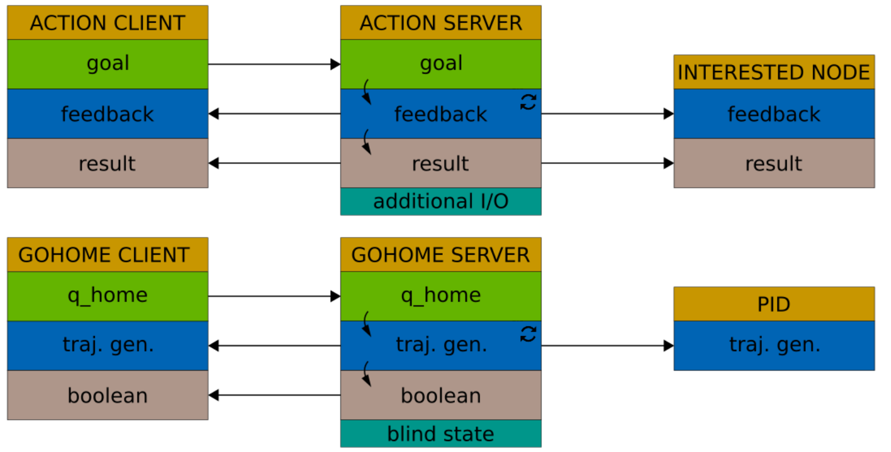

# Common actions
## Introduction
This repository implements actions in dls2.

## What is an action?
An action can be seen as a long running service that executes tasks given a desired goal, providing feebacks and a final result. 

The client sends goal to the server and can access to feedbacks and result information.

The server receives the goal and starts executing the procedure, publshing feedback and providing a result when the action is concluded. It runs on a separate thread.

This is ax example about the goHome and goFold actions.

The ServiceLayer has an ActionClientStock instance: it stocks common clients of actions (e.g. goHome, goFold). Each client has a console command that allows to:
	- loads at runtime the action server (so it is a separate process)
	- send the goal to the server

Architecture suitable also for other common and emergency procedures.

## Future improvements
Avoid sleeps before sending goal command.