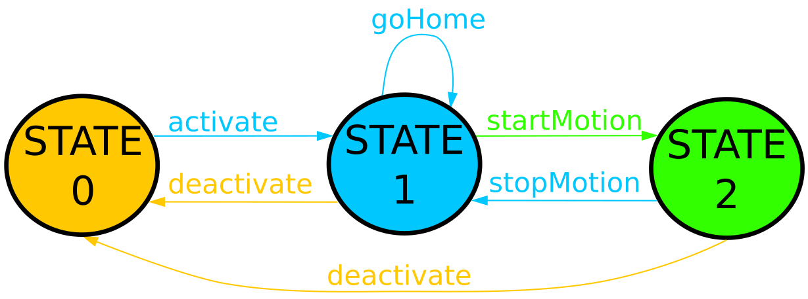

# COMMANDS

## Introduction
In this section it is described what is a command in DLS2 and what happens when an user request the execution of a command from the console.

#### Prerequisites
Read at least at the [Introduction](https://fast-dds.docs.eprosima.com/en/latest/02-formalia/titlepage.html) and [Getting Started](https://fast-dds.docs.eprosima.com/en/latest/fastdds/getting_started/getting_started.html) sections of the FastDDS documentation.
## What is a command in DLS2?
As you might already know, DLS2 is a distributed system, where each entity/module can easliy join the pletora of entities communicating in a specific domain (or connected to a server). Such entities can define a set of console commands that an user can execute to interactively change their behaviour while running all together. To comply with the distributed structure, a publisher-subscriber paradigm is implemented to execute a console command belonging to a specific entity.

When typing an existing command name in the console, the Data Writer (DW) of the console layer publishes it on the _command_call_ topic. Each command is a **Data Reader** (DR) subscribed to _command_call_ that receives the command name requested from the console. If its name is the one requested, the command is executed.

Since a command is a DR, it belongs to a Domain Participant (DP), and it lives in the _dls::domains::command_ DDS domain, as also DW does. The name of a command is identified by the name of the DP to which it belongs. This name is composed by a namescope identifying the owner of the command, and the actual command name. The format is as follows

    CommandOwner::command_name

where _CommandOwner_ is the name of the entity that has created the command, while _command_name_ is the actual name of the command.

For example in this case

    periodic::startMotion

the entity _periodic_ has created a command called _startMotion_.

IMAGE OF COMMANDS IN DOMAIN

## How a command is activated
Each entity might have several commands. However, a command might have preconditions to be match before it can be made available. For example, there is no need to stop the robot motion if it is not moving. So there is no need of a _stopMotion_ command if _startMotion_ has not been executed. Therefore, a state machine is used to identify which command is available in which state, avoiding to provide unuseful commands.

Let's try to understand with an example. Consider the entity _periodic_. This motion generator can have the following commands:
- _activate_: the motion generator starts sending feet desired references. Such desired configuration is the one the robot has when activating the generator
- _deactivate_: the generator stops sending references
- _goHome_: send desired feet positions corresponding to the home configuration.
- _startMotion_: start the robot motion (e.g. trotting)
- _stopMotion_: stop the robot motion

The following state machine describes what happens when executing each of these commands:

In each state only a subsets of commands is available. In STATE 0 only _activate_ is available and, when executed, the state machine goes in STATE 1 where _goHome_, _startMotion_ and _deactivate_ are now available, but _activate_ is not anymore. _deactivate_ brings the system back to STATE 0, _goHome_ keeps the state machine in STATE 1 and _startMotion_ moves it in STATE 2, where _deactivate_ and _stopMotion_ are available, but _goHome_ is not. _stopMotion_ moves the state back to STATE 1. 

There is a state machine per owner. So if for example it is running the _pid_ and _trunk_controller_ controllers, the _periodic_ motion generator and the _leg_odometry_ state estimator, each of them has its own state machine managing its own commands.

The user should take care about building the state machine for each entity she/he is defining. Such state machine prevents to run commands that depends on the outputs of others, thus improving the robustness of the simulation/experiment.

## How to define a command