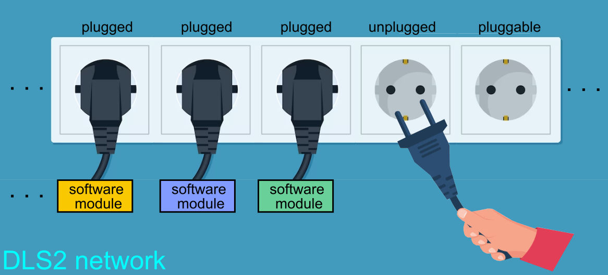
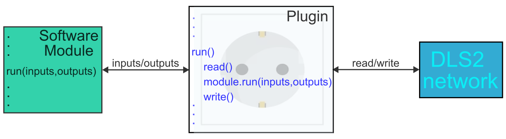

# Plugin_base

## Introduction
This C++ library provides an interface to connect an external software module to DLS2.

#### Prerequisites
Read at least at the [Introduction](https://fast-dds.docs.eprosima.com/en/latest/02-formalia/titlepage.html) and [Getting Started](https://fast-dds.docs.eprosima.com/en/latest/fastdds/getting_started/getting_started.html) sections of the FastDDS documentation.

## What is a plugin?
One of the main feature of DLS2 is the ability to plug and unplug a new software at run-time into the DLS2 network. This ensures modularity, scalability and trasparency.

Different software module can have different inputs and outputs, so each module has its own plugin. A plugin is a component attached to the DLS2 network that:
* reads the module inputs from the DLS2 middleware
* write the module outputs in the DLS2 middleware

In this way, the implementation of the software module can be independent from the DLS2 middleware. The user can therefore mainly focus on the development of its own software module, being agnostic with respect to the communication channel used to receive inputs and to send outputs.

We can have periodic plugin, running at a specified frequency, or aperiodic plugin, such as services.

### Periodic app plugin
#### PeriodicAppPlugin class overview
The PeriodicAppPlugin class is the interface that allows a software module to run periodically, while communicating with the DLS2 network. It can run in either REAL-TIME or BEST-EFFORT manner. The plugin of each module is implemented as a class inheriting from PeriodicAppPlugin. This class allows the specific plugin to:
* be loaded at runtime, through the *create_t* function
* add inputs to the plugin, with the *buildInput* function 
* add outputs to the plugin, with the *buildOutput* function
* run periodically the *run* function
* read/write all the inputs/outputs from/to the DLS2 network

The *create_t*, *destroy_t* and *run* functions has to be implemented implemented in any class inheriting from PeriodicAppPlugin. See [How to write a periodic plugin](#how-to-write-a-periodic-plugin) section.

When creating an input, the plugin performs two steps:
* create a data reader, subscribed to the desired topic
* store the pointer to the input variable, used by *read()*. This function automatically gets the last message read by each data reader and updates each corresponding input variable through its pointer

Similarly, when creating an output, the plugin performs two steps:
* create a data writer, publishing to the desired topic
* store the pointer to the output variable. With this pointer, the plugin is aware of the current state of the output variable. Therefore, when calling the *write()* function, the plugin can automatically publish all the outputs, by setting also the timestap of the output, if it has one.

#### How to write a periodic plugin
In this section it is described which are the components that a specific plugin must have and how to implement them. The [Overview](#overview) section describes the components. The [Steps](#steps) section instead, tells you how to create a plugin, by following what it is written in the overview. So you could directly go to the [Steps](#steps) section, despite it is kindly suggested to read the overview.

##### Overview
The connection between a module to be run periodically and its Plugin is depicted in the following figure 

The basic idea is that the Plugin calls in its run function the run function of the module, allowing to:
* set inputs to the module, read from the DLS2 network
* get outputs of the module, writing them in the DLS2 network

The specific Plugin of the module has to be a C++ class inheriting from PeriodicAppPlugin. In this way, to run the software module at an arbitrary rate, you need to load from the command line its associated Plugin. To do that, the Plugin has to implement the *create_t* fuction, inherited from PeriodicAppPlugin class. This function is called when loading the Plugin at run-time, and it is responsible to call the Plugin constructor. Another function, *destroy_t*, has to be implemented too, to call the Plugin destructor once its instance is destroyed.

The Plugin has to store internally the following main objects:
* module object: this is an instance of your module class
* console command object: this is an instance of the class storing the console commands, that allows you to interact with the module at run-time
* inputs variables: they are updated with the last read message, when calling the *read()* function
* outputs variables: they are read by the plugin, and they are published to the DLS2 network when calling the *write()* function (the timestamp is already filled by *write()*)

Once it is loaded, the Plugin constructor has to:
* initialize the module and console commands objects
* initialize the inputs and outputs
* create a sets of signal readers, for getting the module inputs from the DLS2 network
* create a sets of signal writers, for sending the module outputs to the DLS2 network

Upon construction, the Plugin starts executing its run function periodically, which has to call three main functions: 
* *read()*: it gets all the inputs of the module from the DLS2 network
* *module.run(inputs, outputs)*: it calls the run function of the module, which is responsible for implementing the module logic. Here *module* is the instace of your module class
* *write()*: it sends all the outputs of the module to the DLS2 network

From this structure, it easy to understand that the only compatibility requirement a module has to have to communicate with the DLS2 network is to define a *run(input,outputs)* function, whose arguments are the inputs and the outputs of the module.

#### What is an input?
In the Plugin an input is identified by:
* a topic to read from
* a SignalReader object, creating a data reader listening on the topic, and built by the *buildInput* function
* an input variable, of message wrapper type, that is updated each time the *read()* function is called

the SignalReader object is stored in a variable of the PeriodicAppPlugin class. The input variable instead has to be defined in the Plugin.

#### What is an output?
In the Plugin an output is identified by:
* a topic to write to
* a SignalWriter object, creating a data writer publishing on the topic, and built by the *buildOutput* function
* an output variable, of message wrapper type, whose content is sent to the topic each time the *write()* function is called

the SignalWriter object is stored in a variable of the PeriodicAppPlugin class. The output variable instead has to be defined in the Plugin.

##### Custom console commands
To interact with your module through the DLS2 console, you can create a C++ class that stores and implements all the console commads. This class should:
*  have a pointer to the module object, which it is used in the console commands implemementation to change the variable of the object
* register each of the console command to the command manager of the Plugin

Once an instance of this class is created in the Plugin class, all the console commands became available.

##### Steps
From the organization point of view, for each plugin there is a repo.
To create a periodic plugin:
* [create an empty repo on GitLab](https://gitlab.advr.iit.it/projects/new)
* pull the repo you have just created in the folder shared with the dls2 docker image (any subfolder of it is also fine)
* open the dls2 docker image
* build and install dls2_deploy
* go inside the repo you have just pulled
* call the following command

        create_periodic_plugin

    that requests you to provide
    * a Plugin Type, that can be any of these
        * hardwares
        * controllers
        * estimators
        * motion_generations
    * a Plugin name. This will be automatically also the name of your module

    This command will create in the current directory (so in your repo) a basic project structure with the following main folders:
    * module: where you develop your module
    * plugin/core: where you develop the plugin
    * plugin/console_commands: where you develop your console commands
    * plugin/messages: where you develop custom messages
    * plugin/topics: where you develop custom topics
    
    The Plugin, module and console commands classes are automatically created, together with some suggestions on how to customize your plugin.
    
    Moreover, in the project structure there is also the possibility to define custom messages and topics, that you can use in your plugin and made available to the DLS2 network.
* follow the instruction in the README of the project you have just created. You can find the README also [here](https://gitlab.advr.iit.it/dls-lab/dls2/-/tree/clear_inputs_outputs/modules%2Fplugin_base%2Fskeletons%2Fperiodic#periodic-plugin).

### App plugin class overview
TODO
